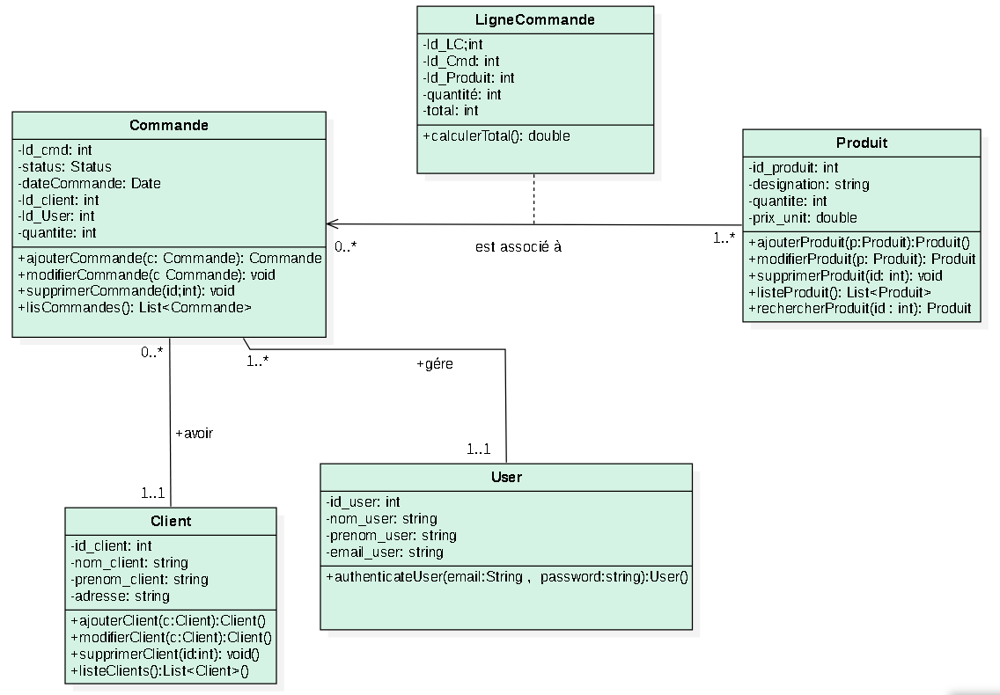
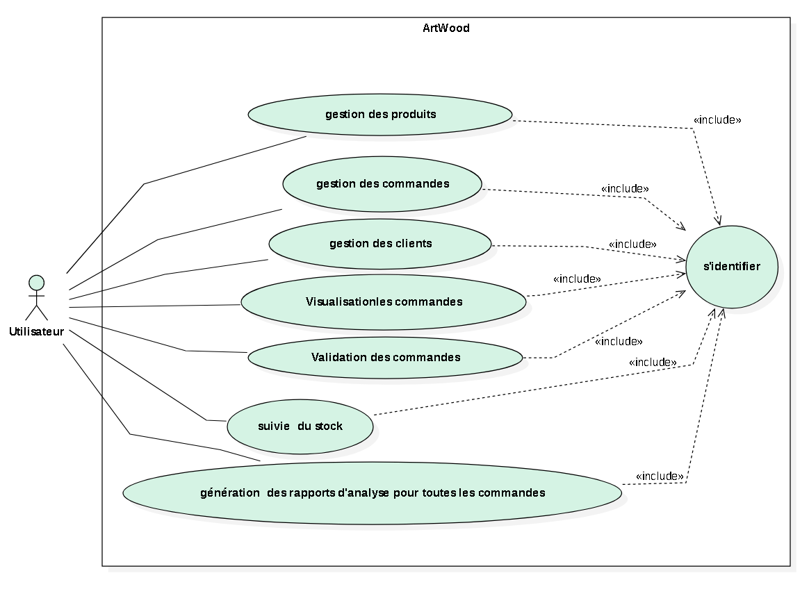

# ArtWood- Application de Gestion des Commandes d'ArtWood

## Description
Ce projet est une application de gestion des commandes développée pour l'entreprise artisanale ArtWood. Elle a été migrée depuis une technologie Java EE (JSP, Servlets) vers une architecture moderne et évolutive basée sur Spring Core MVC avec Thymeleaf.

## Fonctionnalités

1. **Ajout de Commandes**
    - Les utilisateurs peuvent ajouter ,modifier,afficher et supprimer les commandes .

2. **Visualisation des Commandes**
    - Une interface intuitive permet aux utilisateurs de voir l'état d'avancement des commandes en cours, y compris les détails spécifiques de chaque commande.

3. **Validation des commandes**
    - Les utilisateurs ont la possibilité de marquer les commandes comme complètes une fois qu'elles ont été traitées. Cela permet de suivre facilement les commandes encore en attente.

4. **Gestion des Clients**
    - Un module de gestion des clients permet aux utilisateurs de créer, afficher et mettre à jour les informations clients pour une gestion centralisée.

5. **Suivi des Stocks**
    - Intégration d'une fonctionnalité de suivi des stocks pour s'assurer que les articles nécessaires sont disponibles pour satisfaire les commandes.
6. **Gestion des produits**
    -  Les utilisateurs peuvent ajouter ,modifier,afficher et supprimer les produits.
 7. **Rapports d'Analyse des Ventes** : Un module de génération de rapports offre aux utilisateurs la possibilité d'analyser les tendances de vente, les préférences des clients, et les performances des articles.

## Diagrammes de Classes

## Stack Technique

- **Langage de Programmation:** Java
- **Frontend:**  Thymeleaf pour les vues dynamiques
- **Backend:** spring Core (IOC, DI) - Spring MVC - Hibernate - Spring Data JPA 
- **Gestion de Dépendances:** Apache Maven
- **Base de Données:** MySQL
- **Serveur d'Application:** Jetty
- **Logging:** SLF4J (Simple Logging Facade for Java) pour la gestion des journaux
